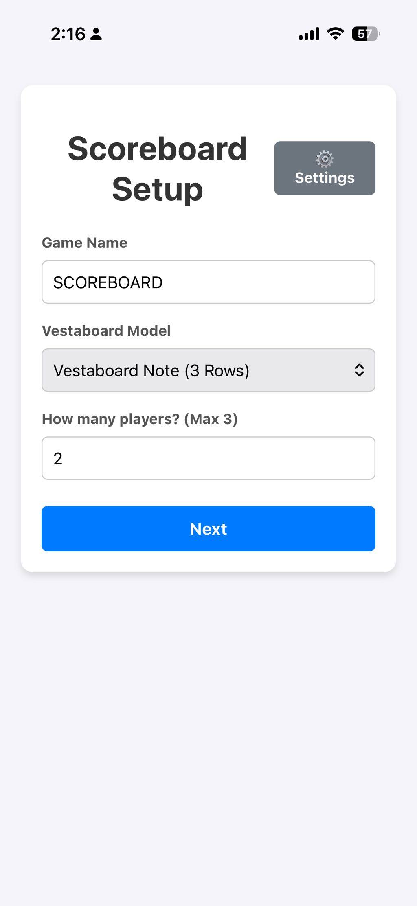
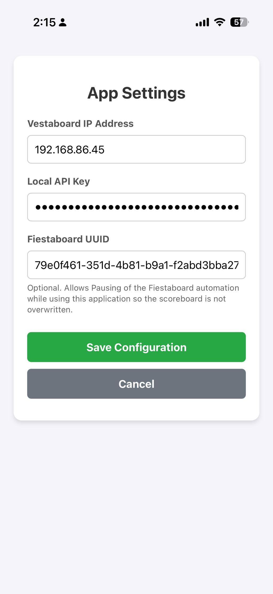
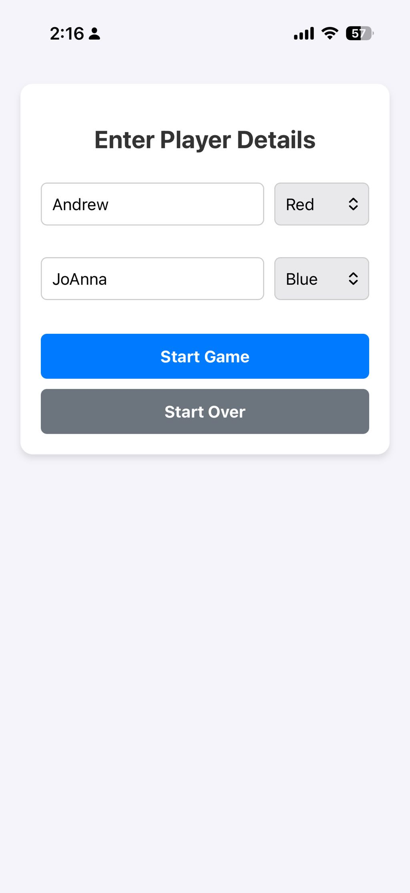

# Fiestaboard-WebApp
A self hosted website to interact with a Vestaboard as a live scoreboard

A lightweight, self-hosted web application designed to run on a Raspberry Pi. It provides a mobile-friendly UI to track player scores and instantly updates your Vestaboard in real-time using the Local API. 

## Features
* **Real-time Scoring:** Tap to add/subtract points or edit scores directly.
* **Multi-Board Support:** Dynamically adjusts layouts for Vestaboard Standard (up to 6 players) and Vestaboard Note (up to 3 players).
* **Custom Colors & Titles:** Assign specific Vestaboard color tiles to players and display a custom game title.
* **Fiestaboard Integration:** Easily pause/resume your Fiestaboard server during gameplay so it doesn't overwrite your scores.
* **Browser-Based Config:** Set your IP and API keys directly from the web UI (no terminal editing required).

   


## Prerequisites
* A Raspberry Pi (or any Linux-based machine)
* Python 3 installed
* Your Vestaboard's Local API enabled (you will need the IP address and Local API Key)

## Installation

**1. Clone the repository**
Open your terminal and clone this project into your home directory:
```bash
cd ~
git clone https://github.com/cordell25/Fiestaboard-WebApp.git
cd Fiestaboard-WebApp
```

**2. Create a Virtual Environment**
It is highly recommended to run this in an isolated Python environment to protect your system packages.
```
sudo apt update
sudo apt install python3-venv
python3 -m venv venv
source venv/bin/activate
```

**3. Install Dependencies**
```
pip install Flask requests
```

**First-Time Setup**
Before running it in the background, run the app manually to configure your settings:
```
python3 app.py
```

**Test that everything is working**
Open a web browser on your phone or computer and navigate to http://<YOUR_PI_IP_ADDRESS>:5000.
Click the ⚙️ Settings button on the setup screen.
Enter your Vestaboard IP, Local API Key, and Fiestaboard UUID (optional). Save the settings.
Go back to your terminal and press Ctrl+C to stop the server.

**Running as a Background Service (Recommended)**
To keep the scoreboard running 24/7 and automatically start when the Pi reboots, set it up as a system service.

**1. Create the service file:**
```
sudo nano /etc/systemd/system/fiestaboard-webapp.service
```

**2. Paste the following configuration:**
(Note: If your Raspberry Pi username is not _fiesta_, update the User, WorkingDirectory, and ExecStart paths below to match your actual username).
```
[Unit]
Description=Fiestaboard WebApp Hub
After=network.target

[Service]
User=fiesta
WorkingDirectory=/home/fiesta/Fiestaboard-WebApp
ExecStart=/home/fiesta/Fiestaboard-WebApp/venv/bin/python app.py
Restart=always
RestartSec=3

[Install]
WantedBy=multi-user.target
```
Save and exit the editor (Press Ctrl+O, Enter, then Ctrl+X).

**3. Enable and start the service:**
Run these commands to apply the new service and turn it on:
```
sudo systemctl daemon-reload
sudo systemctl enable fiestaboard-webapp
sudo systemctl start fiestaboard-webapp
```

**Useful Troubleshooting Commands**
If you ever need to troubleshoot the background service, use these commands:
Check status: 
```
sudo systemctl status fiestaboard-webapp (press q to exit the log view)
```
Restart app: 
```
sudo systemctl restart fiestaboard-webapp
```
Stop app: 
```
sudo systemctl stop fiestaboard-webapp
```
View recent errors: 
```
sudo journalctl -u fiestaboard-webapp -n 20
```

## Pro-Tip: Setting a Static IP

If your router reboots or your Raspberry Pi loses power, your network might assign the Pi a *new* IP address. If this happens, your saved bookmark (e.g., `http://192.168.1.50:5000`) will stop working, and you will have to plug in a monitor or check your router to find the new address.

To prevent this, it is highly recommended to set a **Static IP**. 

### Method 1: Router DHCP Reservation (Recommended)
The safest way to do this is to tell your router to *always* give the Pi the exact same address.
1. Log into your home router's admin panel (usually by typing `192.168.1.1` or `10.0.0.1` into your browser).
2. Look for a setting called **DHCP Reservation**, **IP Address Allocation**, or **Static Leases** (typically found under LAN or Network Setup).
3. Find your Raspberry Pi in the list of connected devices and assign it a permanent IP address. 

### Method 2: Setting it directly on the Pi
If you prefer to configure the Pi itself and are using a modern version of Raspberry Pi OS (Bookworm or newer), you can use the built-in network manager tool.
1. Run this command in your terminal: `sudo nmtui`
2. Select **Edit a connection** and choose your active WiFi or Ethernet network.
3. Change the **IPv4 Configuration** from `<Automatic>` to `<Manual>`.
4. Select `<Show>` next to IPv4 and enter your desired IP address (e.g., `192.168.1.50/24`), your Gateway (your router's IP), and DNS servers (like `8.8.8.8`).
5. Save, exit, and reboot your Pi.
